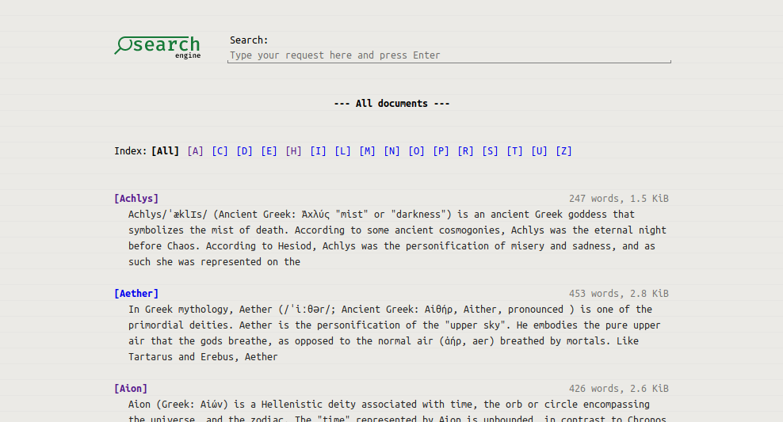
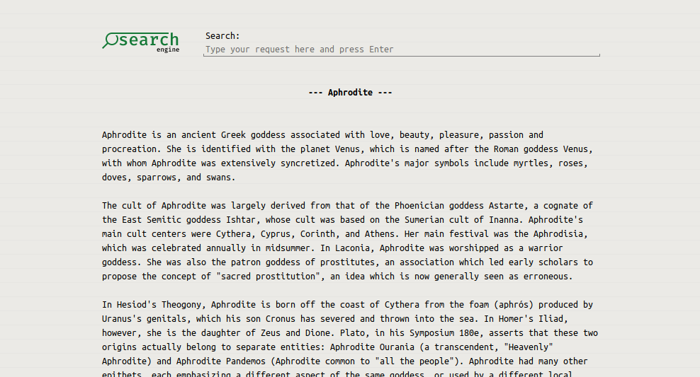
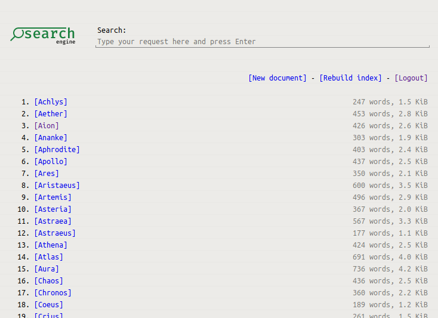
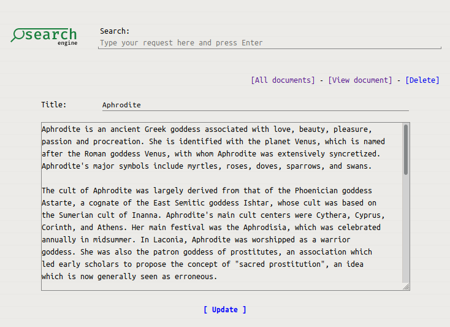

# haskell-search

'haskell-search' is a full-text search engine with a web-interface implemented in
Haskell. I wrote this project as a university assignment for a text retrieval course.

## Indexing

The indexing algorithm extracts words from documents, stems them using Porter's
algorithm, and constructs a reverse index. It then writes on disk the list of documents
containing each term along with positions of the term in the document. Part of the index
is loaded into RAM during the program startup.

## Searching

The retrieval algorithm finds all documents that contain a certain percentage of the
request's terms. The results are sorted by the distance of terms' occurrence in the
document.

## Configuration

The configuration is loaded from "webse.ini" file in the system configuration directory.
It contains the following fields:

* *docs/path*: Path to the directory with documents and index files. (Note that text
  documents must be added via the admin UI and not be manually placed in this
  directory). Default value: `<system's data directory>/webse`.
* *auth/secret*: A hex-encoded random string that must be kept secret. Used for
  authentication.
* *auth/password-hash*: SHA256 digest of the admin's password.

## User interface

The list of documents:

Detail view of a document:

Admin UI implements CRUD operations: creation, deletion, and editing of documents. Note
that the index must be rebuilt afterward.

|  |  |
|--|--|
